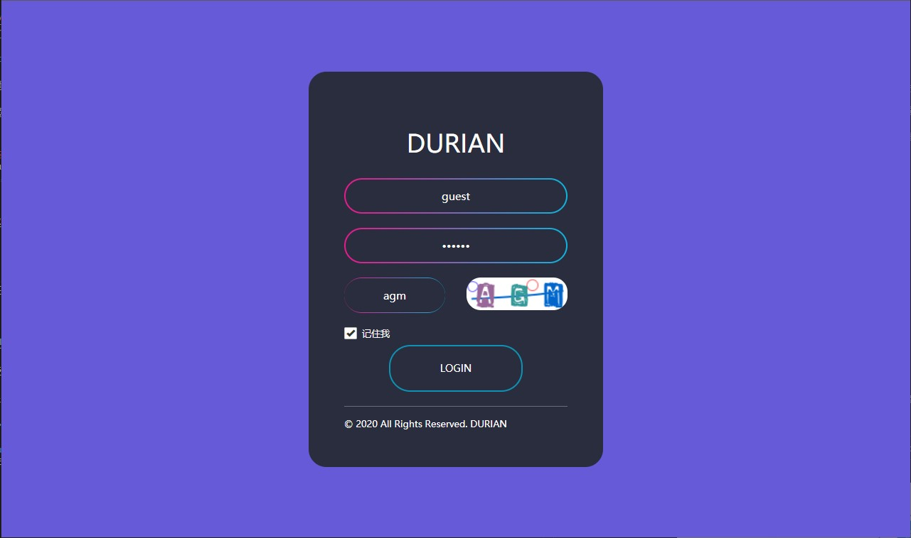
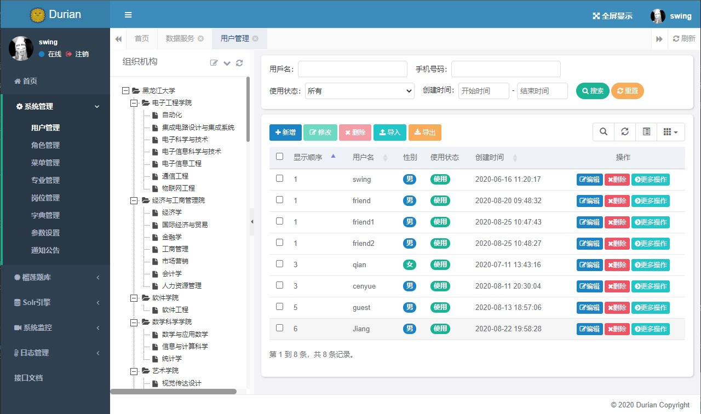
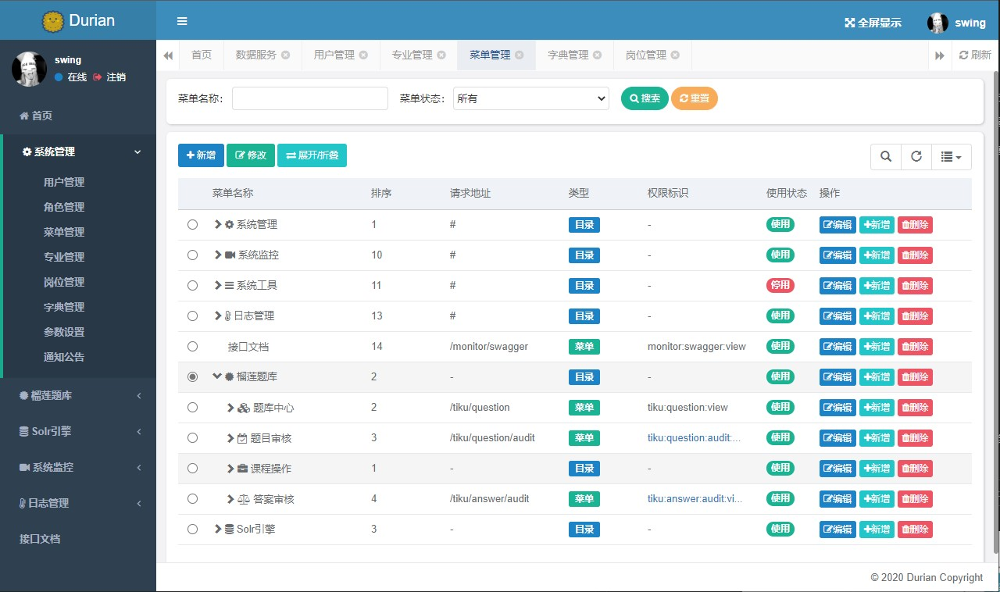
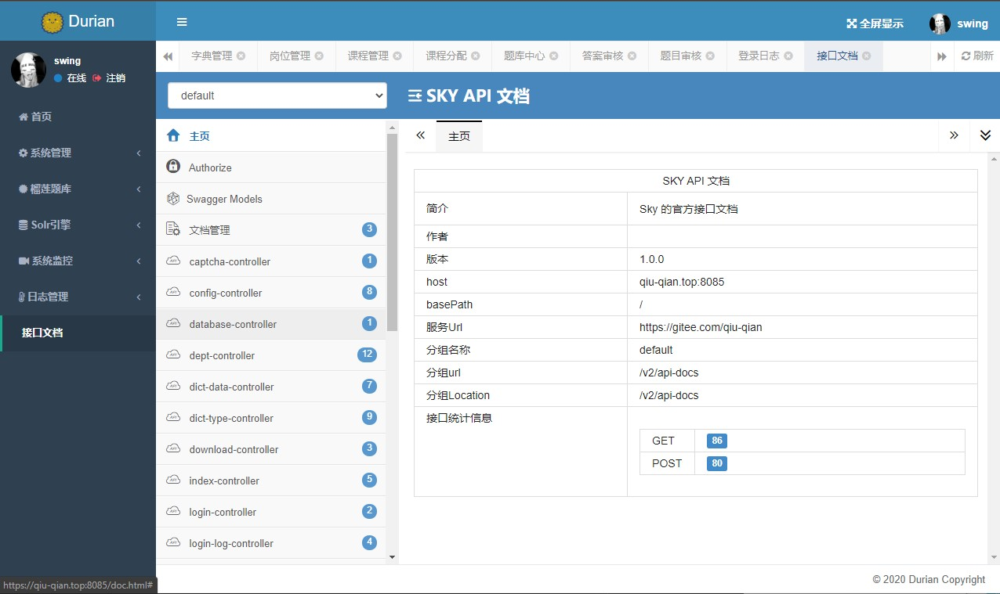
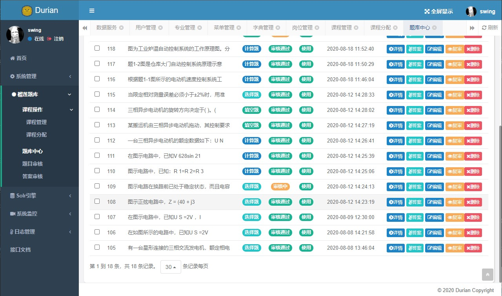
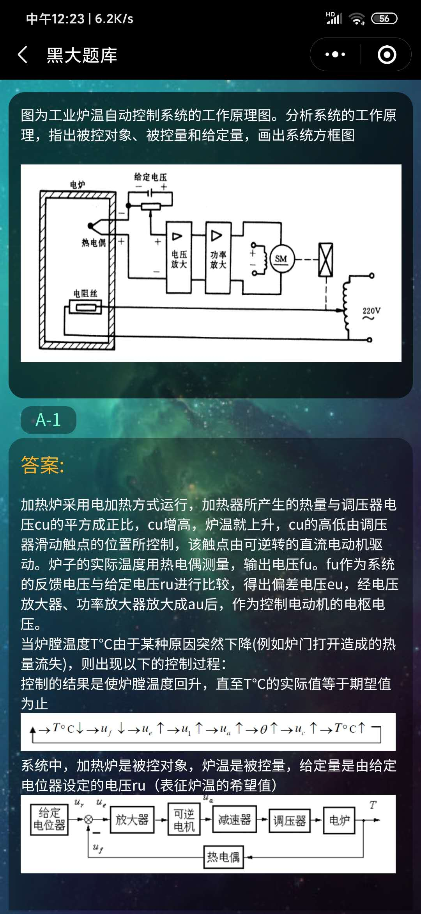
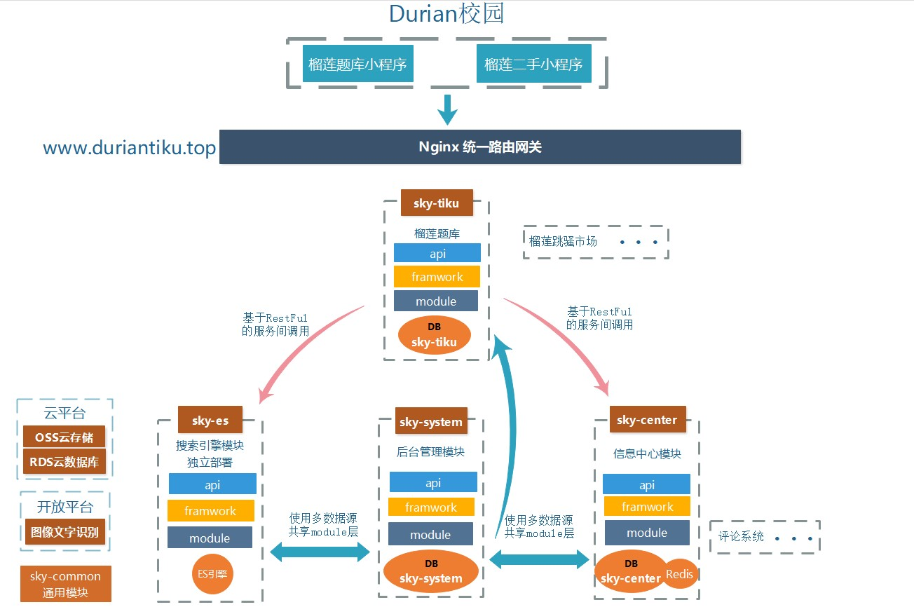

# Durian
<p align="center">

<p>

--------------------------------------------------------------------------------

[English](./README.en.md) | 简体中文

[](https://gitee.com/qiu-qian/Durian/wikis/pages)
[](LICENSE)

## 介绍 

 榴莲校园，一个专注于Java技术的实践集合，致力于为校园提供一套便捷的技术服务。
 
 涉及后台管理，多级鉴权，单点登录，solr引擎全文检索，校园题库，校园二手（开发中），校园云盘等多种技术服务。搭建框架，化繁为简，提高你的开发效率，使您专注于业务逻辑的开发。
 
 本项目的后台管理模块是基于我的另一个开源项目[Sky](https://gitee.com/qiu-qian/sky.git)，除后台管理模块使用Thymeleaf渲染以外，其他模块皆为restful风格的api，使用微信小程序做的前后端分离。为了专注与业务逻辑，对于持久层的代码，我专为项目设计了与之适应的代码生成器[Orange](https://gitee.com/qiu-qian/Orange.git)，支持关联结构(非外键)的代码生成，使您的二次开发更加快速。

 详细信息，请参考项目开发文档：[Durian开发文档](https://gitee.com/qiu-qian/Durian/wikis/pages)


<b>特别声明：本项目可用于学习或毕设，（如需商用，请联系我） ! ! !</b>

后台演示地址：[https://qiu-qian.top](https://qiu-qian.top:8085/)

题库小程序演示地址：

文档地址： [Durian开发文档](https://gitee.com/qiu-qian/Durian/wikis/pages?sort_id=2720449&doc_id=892234)

后台仓库地址：[https://gitee.com/qiu-qian/Durian](https://gitee.com/qiu-qian/Durian)

小程序仓库地址：[https://gitee.com/qiu-qian/durian-mini](https://gitee.com/qiu-qian/durian-mini)

## 预览 

### 后台预览
<table>
<tr> 
<td></td>
<td></td>
</tr>
<tr> 
<td></td>
<td></td>
</tr>
<tr> 
<td></td>
<td></td>
</tr>
</table>

### 小程序预览

<table>
<tr> 
<td></td>
<td></td>
<td></td>
</tr>
</table>


## 快速部署

在部署前，请确保你已经搭建好如下的部署环境 [Durain部署环境](https://gitee.com/qiu-qian/Durian/wikis/pages?sort_id=2725320&doc_id=892234)

### 后台管理模块部署
 
克隆代码，将`sky-api-system/src/main/resources/application.yml`文件中的数据库配置修改为你自己的配置，然后执行如下命令
 ```shell
cd Durian/
#打包
mvn clean package -Dmaven.test.skip=true
#运行
java -jar sky-api-system/target/sky-api-system.jar
 ```
启动成功后，打开浏览器，访问 `localhost:8085`

### 单点登录模块部署
为了使每个服务的用户信息得到统一，项目提供一个统一的单点登录中心，供所有模块登录，具体的登录模式，请参考 [会员单点登录模式](https://gitee.com/qiu-qian/Durian/wikis/pages?sort_id=2801227&doc_id=892234)
登录用户的信息会缓存在redis中，请确保你已经启动redis。
将`sky-api-oss/src/main/resources/application.yml`文件中的数据库配置修改为你自己的配置，然后执行如下命令
```shell
cd Durian/
#打包
mvn clean package -Dmaven.test.skip=true
#运行
java -jar sky-api-oss/target/sky-api-oss.jar
```

### solr搜素引擎模块
为了实现分词全文检索，高亮标注等功能，还需要启动搜索引擎模块，确保你已经在docker中安装了solr（或其他安装方法）

修改 `sky-api-solr/src/main/resources/application.yml` 中的数据库和solr配置，如下：
```yaml
#注意这里需要设置一个安全密钥，之后更新solr中的数据，或者全文检索，都需要携带该密钥才可请求
sky-security:
  #更新操作的安全密钥
  updateKey: ainimemeda

data:
    #solr搜索引擎
    solr:
      host: http://localhost:8089/solr/durian_core
```

```shell
cd Durian/
#打包
mvn clean package -Dmaven.test.skip=true
#运行
java -jar sky-api-solr/target/sky-api-solr.jar
```

### 榴莲题库模块的启动
有了上面那些基础的服务，题库模块的启动就很简单了，搜先修改 `sky-api-oss/src/main/resources/application.yml`数据库配置和登录中心配置

```yaml
#登录中心地址
oss:
  url: 127.0.0.1:8087
```

```shell
cd Durian/
#打包
mvn clean package -Dmaven.test.skip=true
#运行
java -jar sky-api-tiku/target/sky-api-tiku.jar
```

至此，题库模块的部署已经基本完成，小程序的部署请参考 [Durian小程序的部署文档](#)

## 项目结构 

项目采用模块化的设计，遵循低耦合高内聚的设计思想，各个模块可单独部署，一个独立的项目模块（例如榴莲题库模块）是由如下三个子模块组成：

<table align="center">
<tr>
<td>sky-module-tiku</td>
<td>持久层和Service接口，此处代码可完全由生成器生成</td>
</tr>
<tr>
<td>sky-framework-tiku</td>
<td>相关框架，例如spring，mybatis等配置</td>
</tr
><tr>
<td>sky-api-tiku</td>
<td>对外提供api服务</td>
</tr>
</table>

<p align="center">

<p>

### Solr搜索模型

<p align="center">

<p>

## 功能概览

<p align="center">

<p>


## 捐赠 
多多支持多多star!!!


开源不易，演示服务器每个月还要缴费，可以请作者喝一瓶哇哈哈：

<div align="center">

</div>