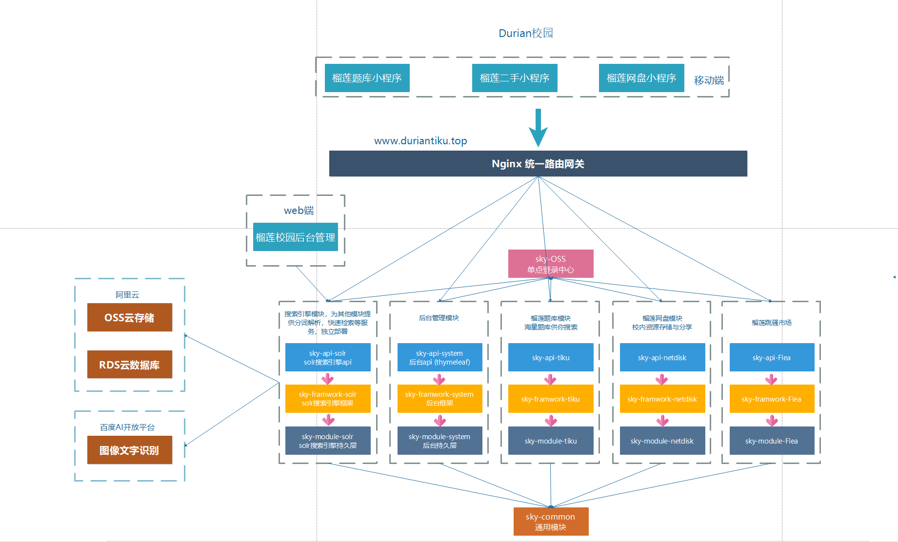
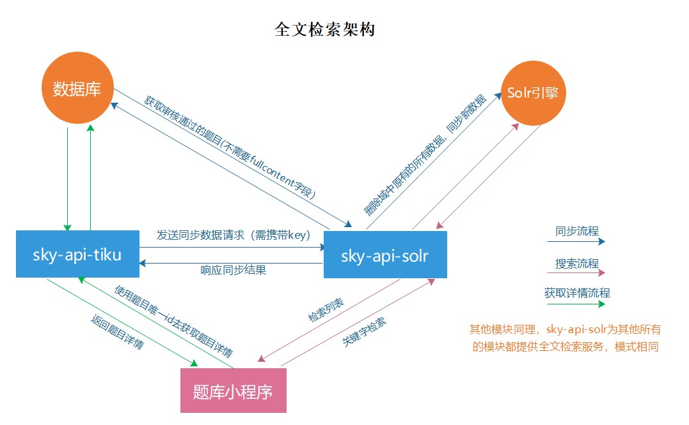
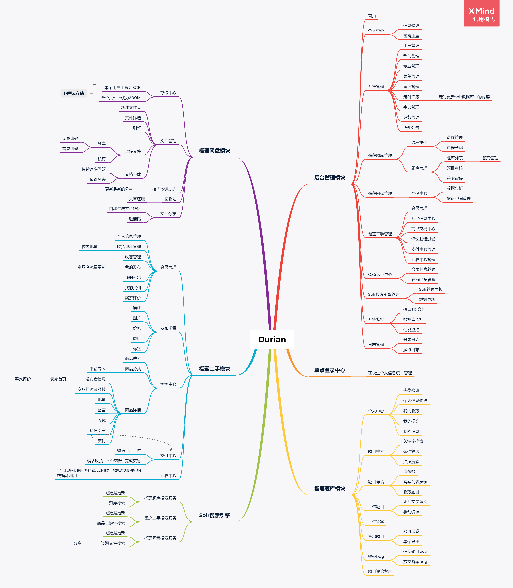

# Durian

--------------------------------------------------------------------------------

[English](./README.en.md) | 简体中文

## 介绍 
榴莲校园，一个Java技术的实践集合，涉及后台管理，权限集合，solr搜索引擎，校园云盘，校园题库，校园二手等多种技术服务。搭建框架，化繁为简，提高你的开发效率，使您专注于业务逻辑的开发。本项目的后台管理模块是基于我的另一个开源项目[Sky](https://gitee.com/qiu-qian/sky.git),除后台管理模块使用Thymeleaf渲染以外，其他模块皆为restful风格的api，使用微信小程序做的前后端分离。对于持久层的代码，为了专注与业务逻辑，我专为项目设计了与之适应的代码生成器[Orange](https://gitee.com/qiu-qian/Orange.git)，支持关联结构(非外键)的代码生成，使您的二次开发更加快速。

<b>特别声明：本项目可用于学习或毕设，禁止商用!!!</b>

后台演示地址：[https://qiu-qian.top](https://qiu-qian.top:8085/)

题库小程序演示地址：

文档地址： [Durian开发文档](https://gitee.com/qiu-qian/Durian/wikis/pages?sort_id=2720449&doc_id=892234)

## 预览 

## 项目结构 
项目采用模块化的设计，遵循低耦合高内聚的设计思想，各个模块可单独部署，一个独立的项目模块（例如榴莲题库模块）是由如下三个子模块组成：
<table align="center">
<tr>
<td>sky-module-tiku</td>
<td>持久层和Service接口，此处代码可完全由生成器生成</td>
</tr>
<tr>
<td>sky-framework-tiku</td>
<td>相关框架，例如spring，mybatis等配置</td>
</tr
><tr>
<td>sky-api-tiku</td>
<td>对外提供api服务</td>
</tr>
</table>

### Solr引擎搜索模型

## 功能介绍

## 捐赠 
多多支持多多star!!!

开源不易，演示服务器每个月还要缴费，可以请作者喝一瓶哇哈哈：

