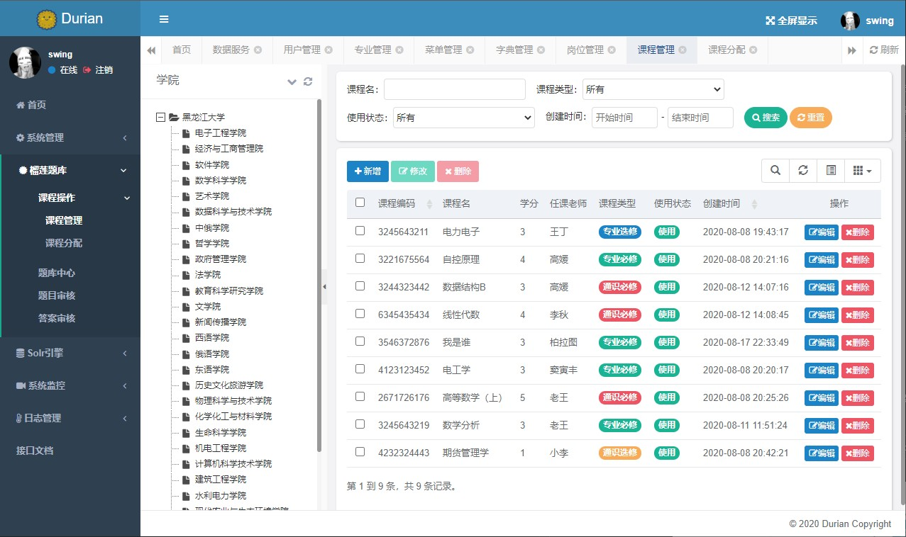

# Durian
<p align="center">

<p>

--------------------------------------------------------------------------------

[English](./README.en.md) | 简体中文

[](https://gitee.com/qiu-qian/Durian/wikis/pages)
[](LICENSE)

## 介绍 

 榴莲校园，一个专注于Java技术的实践集合，致力于为校园提供一套便捷的技术服务平台。

 想法起于这段时间接手的几个校内应用，例如题库，信息发布，校内社交这类的应用。这些应用无一都需要管理一些基本的信息，例如会员，专业，课程等。又或者都需要一些常用的功能，例如评论，全文检索，后台管理等。慢慢发现，其实开发一个简单，低并发的校内应用，特别是在学习时，这些通用的功能其实占据了开发任务的很大一部分，十分冗余，让人很难专注于这个应用本身的业务。

 因此我想到了做一个轻量级的校内应用平台，为在这个平台上开发的应用提供一些基本的服务，如搜索引擎服务，校内信息中心，评论系统等，化繁为简，提高你的开发效率，使您专注于业务逻辑的开发。

 平台的雏形已基本搭建，为演示效果，我使用一个题库小应用（榴莲题库）作为在此平台上开发的demo。
 
 本项目的后台管理模块是基于我的另一个开源项目[Sky](https://gitee.com/qiu-qian/sky.git)，除后台管理模块使用Thymeleaf渲染以外，其他模块皆为restful风格的api，使用微信小程序做的前后端分离。为了专注与业务逻辑，对于持久层的代码，我专为项目设计了与之适应的代码生成器[Orange](https://gitee.com/qiu-qian/Orange.git)，支持关联结构(非外键)的代码生成，使您的二次开发更加快速。

 详细信息，请参考项目开发文档：[Durian开发文档](https://gitee.com/qiu-qian/Durian/wikis/pages)

后台演示地址：[https://duriantiku.top](https://duriantiku.top:8085/)

搜索引擎搜索演示: [搜素题目](https://duriantiku.top:8088/es/search/tiku/question/must?pageNum=0&pageSize=10&content=%E6%8E%A7%E5%88%B6&creatorName=swing&key=ainimemeda)

文档地址： [Durian开发文档](https://gitee.com/qiu-qian/Durian/wikis/pages?sort_id=2720449&doc_id=892234)

后台仓库地址：[https://gitee.com/qiu-qian/Durian](https://gitee.com/qiu-qian/Durian)

榴莲题库小程序仓库地址：[https://gitee.com/qiu-qian/durian-mini](https://gitee.com/qiu-qian/durian-mini) 

(个人精力有限，暂时只提供了题库模块的后台接口，还未实现全部的小程序页面，欢迎爱好前端，爱好开源的小伙伴来协助我完成这个demo)

<b>特别声明：本项目可用于学习或毕设，（如需商用，请联系我） ! ! !</b>

## 预览 

### 后台预览
<table>
<tr> 
<td></td>
<td></td>
</tr>
<tr> 
<td></td>
<td></td>
</tr>
<tr> 
<td></td>
<td></td>
</tr>
</table>

### 小程序预览

<table>
<tr> 
<td></td>
<td></td>
<td></td>
</tr>
</table>


## 快速部署

在部署前，请确保你已经搭建好了部署环境 [Durain部署环境](https://gitee.com/qiu-qian/Durian/wikis/pages?sort_id=2866363&doc_id=892234)

如果您对ES还不太熟悉，请参考我的实践笔记 [ES6.8.11实践笔记](https://gitee.com/qiu-qian/Durian/wikis/pages?sort_id=2803809&doc_id=892234)

目前项目共有三个服务一个应用，如果你的计算机配置允许，可同时全部部署(大概4G内存占用）顺序为
* sky-center 校内信息中心，提供课程，专业，学生信息等服务
* sky-es    搜索引擎服务，为应用提供全文检索服务
* sky-system 后台管理，管理应用信息
* sky-tiku  榴莲题库应用

`注：每个模块都提供了三个环境配置，本地，测试，生产。并提供了一键运行的脚本，以下使用测试环境（该环境下使用本地的Linux虚拟机部署）来做演示，其他环境请自行参考`

### sky-center
配置sky-center/sky-center-api/src/main/resources/application-test.yml
```yaml
 # 此处修改为你自己的数据源
 druid:
      url: jdbc:mysql://127.0.0.1:3306/sky-center
      username: root
      password: 123456

  # 此处修改为你自己的数据源
  redis:
    database: 0
    host: 127.0.0.1
    port: 6379
```
进入 sky-center 目录下，在Linux中运行以下脚本
```bash
chomd +x run-test.sh
./run-test.sh
```
默认后台运行，不占用主线程，浏览根目录(/root)下的 log-center.log文件即可查看运行日志。

### sky-es
配置sky-es/sky-es-api/src/main/resources/application-test.yml
```yaml
druid:
      # 此处修改为你自己的数据源
      # 信息中心数据源
      center:
        # 从数据源开关
        enabled: true
        url: jdbc:mysql://192.168.111.152:3306/sky-center
        username: root
        password: 123456
      # 题库模块数据源
      tiku:
        # 从数据源开关
        enabled: true
        url: jdbc:mysql://192.168.111.154:3306/sky-tiku
        username: root
        password: 123456

# 配置Elasticsearch (配置你之前部署的ES地址）
elasticsearch:
  hostName: 192.168.111.151
  port: 9200
```
进入 sky-es 目录下，在Linux中运行以下脚本
```bash
chomd +x run-test.sh
./run-test.sh
```
浏览根目录下的 log-es.log文件即可查看运行日志。

### sky-system
配置 sky-system/sky-system-api/src/main/resources/application-test.yml
```yaml
    druid:
      # 此处修改为你自己的数据源
      # 后台管理数据源
      system:
        url: jdbc:mysql://192.168.111.153:3306/sky-system
        username: root
        password: 123456
      # 信息中心数据源
      center:
        # 从数据源开关/默认关闭
        enabled: true
        url: jdbc:mysql://192.168.111.152:3306/sky-center
        username: root
        password: 123456
      # 题库模块数据源
      tiku:
        # 从数据源开关/默认关闭
        enabled: true
        url: jdbc:mysql://192.168.111.154:3306/sky-tiku
        username: root
        password: 123456

# 当前服务部署地址：用来为其他服务提供访问地址(修改为你上面部署的地址）
innerService:
  #信息中心
  center:
    url: 192.168.111.152:8087
  #搜索引擎中心
  es:
    url: 192.168.111.151:8088
```
进入 sky-system 目录下，在Linux中运行以下脚本
```bash
chomd +x run-test.sh
./run-test.sh
```
浏览根目录下的 log-system.log文件即可查看运行日志。
访问 ip:8085端口即可进入后台管理界面

### sky-tiku
配置 sky-tiku/sky-tiku-api/src/main/resources/application-test.yml
```yaml
    #修改为你自己的数据源
    druid:
      url: jdbc:mysql://127.0.0.1:3306/sky-tiku
      username: root
      password: 123456

# 当前服务部署地址：用来为其他服务提供访问地址(修改为你上面部署的地址）
innerService:
  #信息中心
  center:
    url: 192.168.111.152:8087
  #搜索引擎中心
  es:
    url: 192.168.111.151:8088
```
进入 sky-tiku目录下，在Linux中运行以下脚本
```bash
chomd +x run-test.sh
./run-test.sh
```
浏览根目录下的 log-tiku.log文件即可查看运行日志。

至此，题库模块的部署已经基本完成，小程序的部署请参考 [Durian小程序的部署文档](#)

## 项目结构 

项目采用模块化的设计，遵循低耦合高内聚的设计思想，各个模块可单独部署，一个独立的项目模块（以信息中心模块举例）是由如下三个（或四个）子模块组成：

<table align="center">
<tr>
<td>sky-center-module</td>
<td>持久层和Service接口，此处代码可完全由生成器生成</td>
</tr>
<tr>
<td>sky-center-framework</td>
<td>相关框架，例如spring，mybatis等配置</td>
</tr>
<tr>
<td>sky-center-api</td>
<td>对外提供api服务</td>
</tr>
<tr>
<td>sky-center-inner</td>
<td>
对内提供服务模块

(由于基于RPC的微服务通信框架较为庞大，之后再考虑此方案，目前使用RestFul实现服务间同通信）</td>
</tr>
</table>

<p align="center">

<p>

### ES搜索模型

<p align="center">

<p>

## 功能概览

<p align="center">

<p>


## 捐赠 
多多支持多多star!!!


开源不易，演示服务器每个月还要缴费，可以请作者喝一瓶哇哈哈：

<div align="center">

</div>